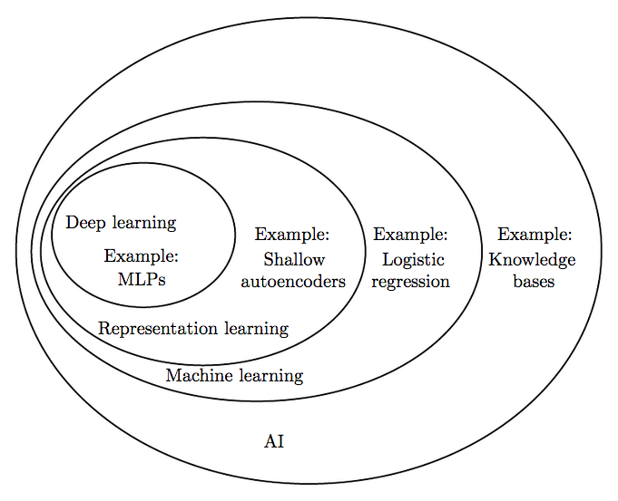

# Deep Learning by Google

Deep Learning is a new branch of machine learning that uses a lot of data to teach
computers to do tasks that previously only humans could do.



The four parts of the course are:

1. logistic classification, stochastic optimization, data/parameter tuning
2. deep networks and regularization
3. convolutional models
4. embeddings, recurrent models

## Notes

Q. What is numerical stability?
A. The accuracy of computational math tasks. For example, if we have a big number
and add very small values to a very large value, we can encounter errors.

```
a = 1000000000
for i in xrange(1000000):
  a+= 1e-6

print a - 1000000000

OUT> 0.953674316406
```

the above should be 1.0 if we were numerically stable!

---

Q. How do we combat numerical instability?

A. We can normalize our inputs and outputs.

Ideally we want them to have mean = 0 and equal variance.


